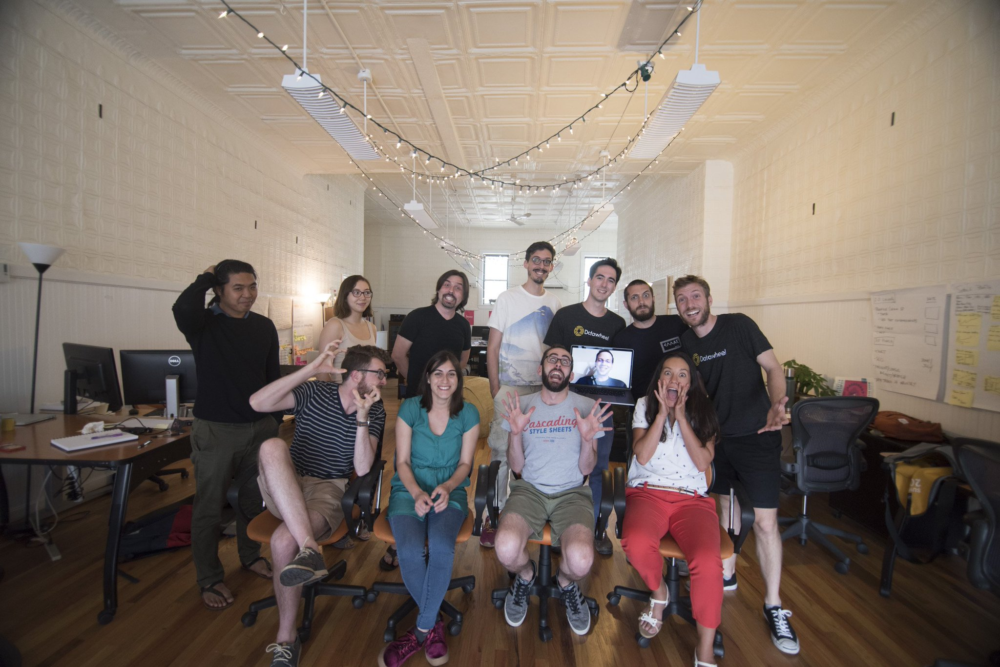
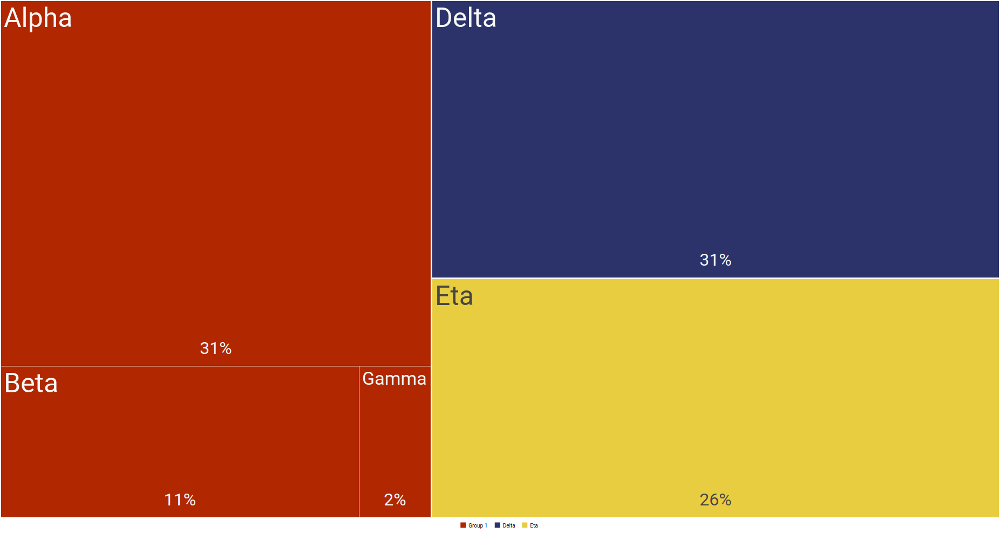
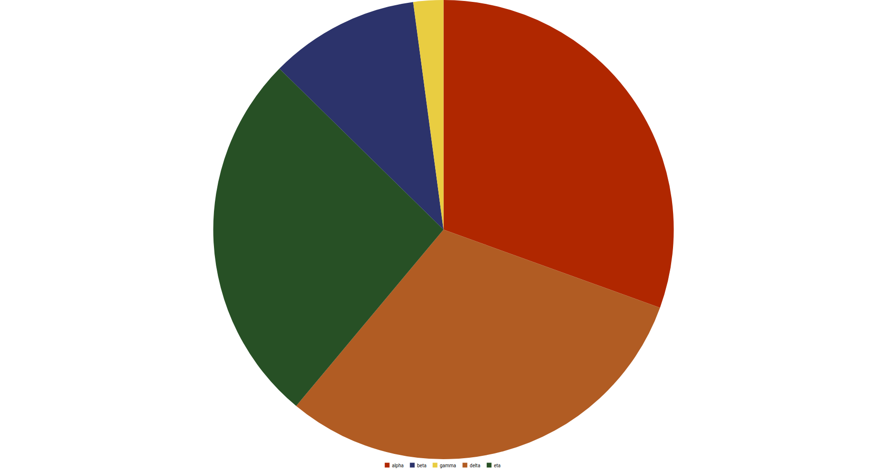
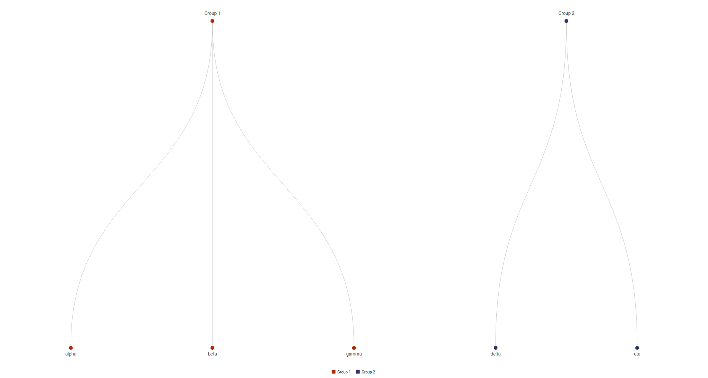
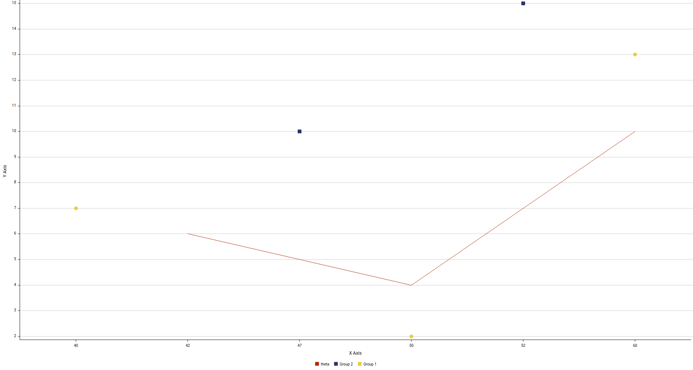
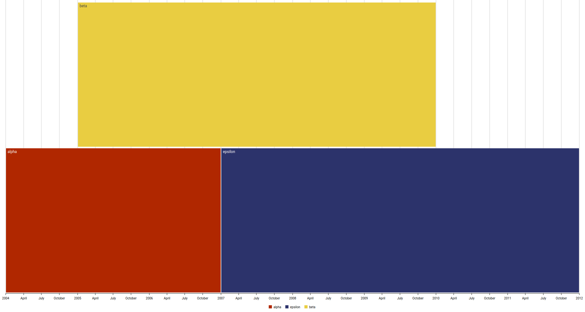
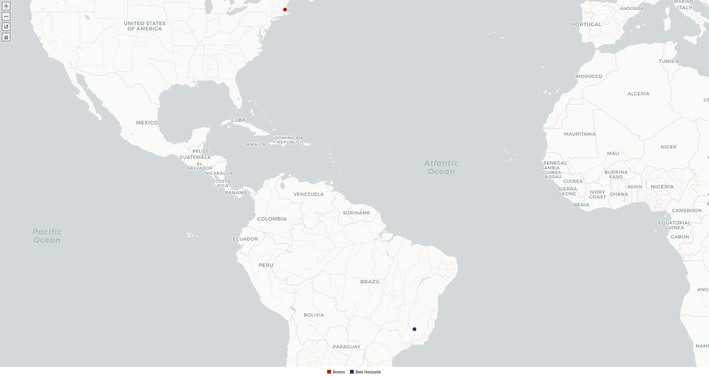

## Agenda

> - Datawheel
> - D3plus
> - Buenas prácticas de visualización de datos
> - Tidy data
> - Uso de D3plus

## Datawheel

> - Datawheel es una startup formada por personas del MIT Media Lab
> - Desarrollamos plataformas de visualización
> - A la fecha contamos con proyectos a escala nacional (DataChile) y global (OEC)

## Datawheel

```{r, out.width="600px", echo=FALSE}

```

Misión: *"Hacer que la información del mundo sea accesible y digerible para beneficio de todos."*

## D3plus

Es una librería de visualización desarrollada por Datawheel y que usamos en los siguientes proyectos:

> - DataChile
> - DataUSA
> - Observatorio de la Complejidad Económica
> - DataViva

D3plus se puede usar en sitios estáticos, se integra con una API y es compatible con React.

# Buenas prácticas de visualización de datos { .center .white data-background="#008744"}

## Escalas

COMPLETAR

## Paletas

COMPLETAR

# Tidy Data { .center .white data-background="#ffa700"}

## Tidy Data

¿Qué es *Tidy Data*?

```{r, echo=FALSE}
knitr::include_graphics("img/tidy-1.png")
```

Fuente: R for Data Science, Wickham & Grolemund

# Uso de D3plus { .center .white data-background="#366ae2"}

## Herramientas necesarias

> - Python v2.7 o superior
> - Atom u otro editor de texto plano

## Descarga la última versión

Ultima versión disponible: [2.0 alpha 16](https://d3plus.org/js/d3plus.v2.0.0-alpha.16.full.min.js)

## Visualización de datos univariados

> - Treemap
> - Pie
> - Tree

## Treemap

```{r, echo=FALSE}

```

## Pie

```{r, echo=FALSE}

```

## Tree

```{r, echo=FALSE}

```

## Visualización de datos complejos

> - Plot

## Plot

```{r, echo=FALSE}

```

## Visualizaciones complejas

> - Priestley
> - Geomap

## Priestley

```{r, echo=FALSE}

```

## Geomap

```{r, echo=FALSE}

```

# Preguntas { .center .white data-background="#ffa700"}
